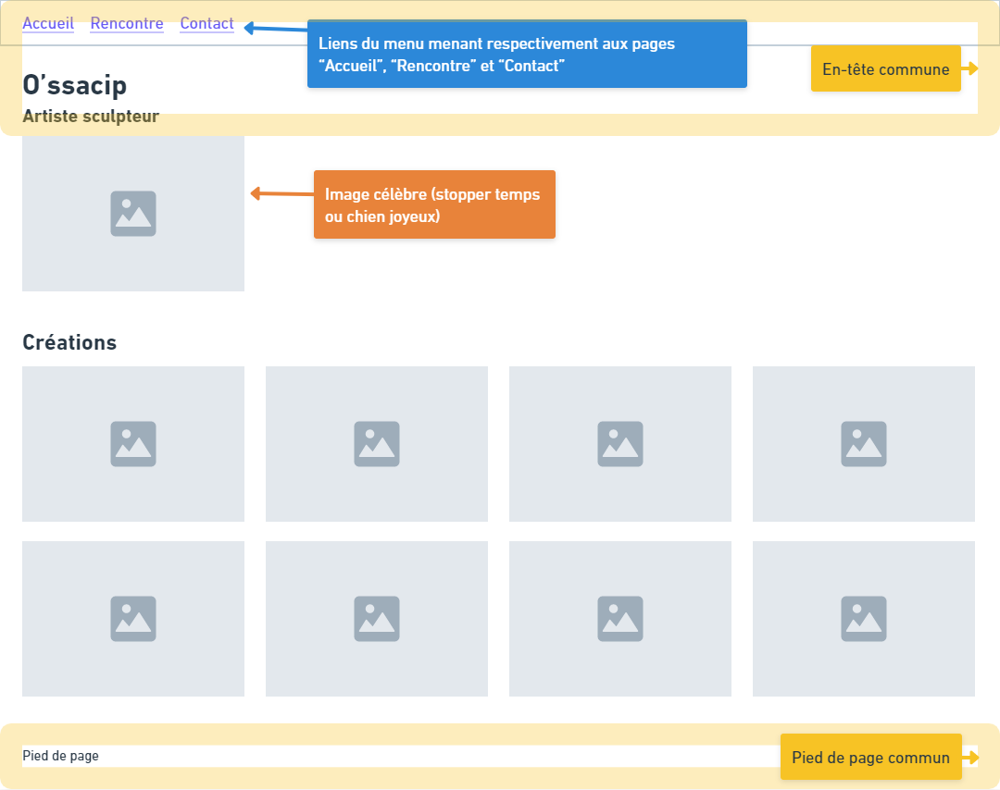
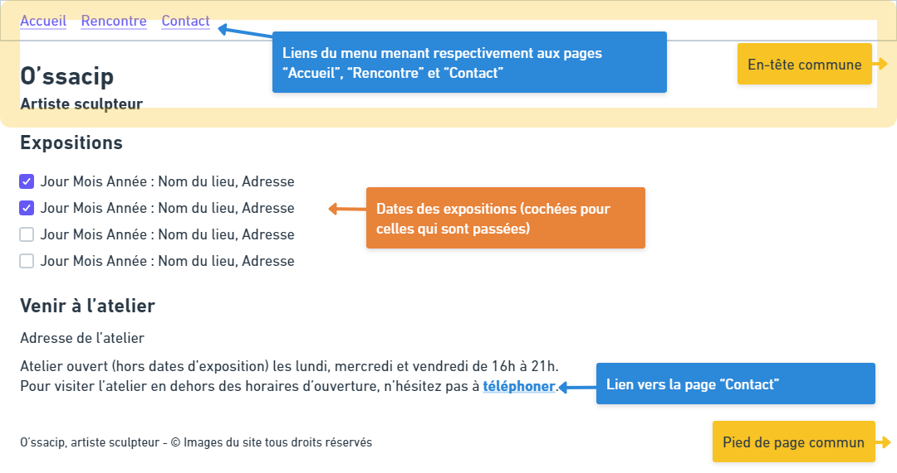
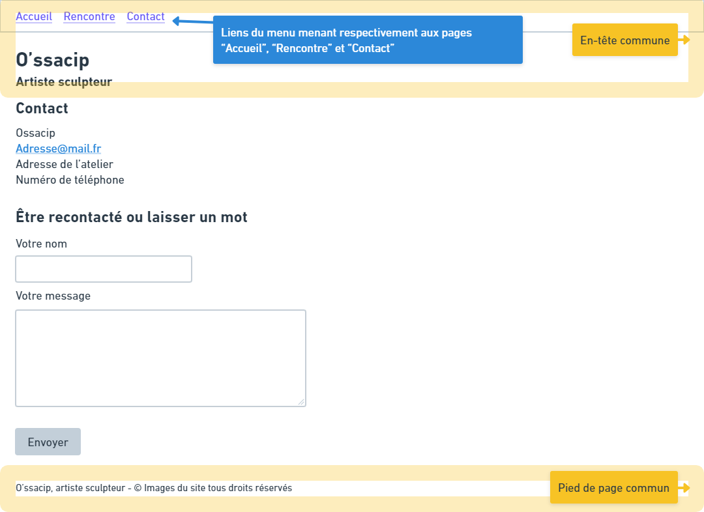
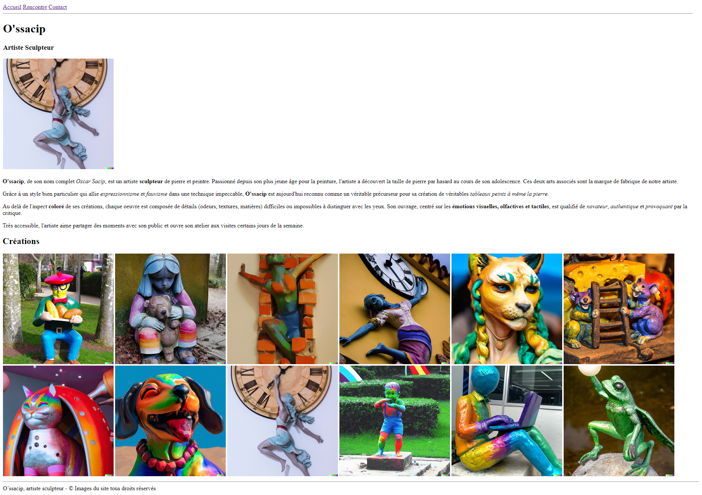
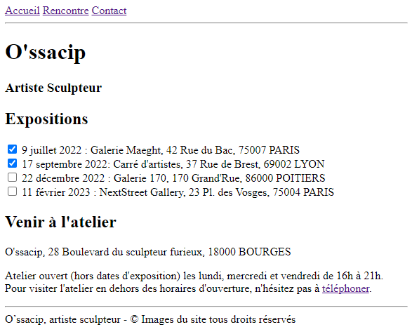
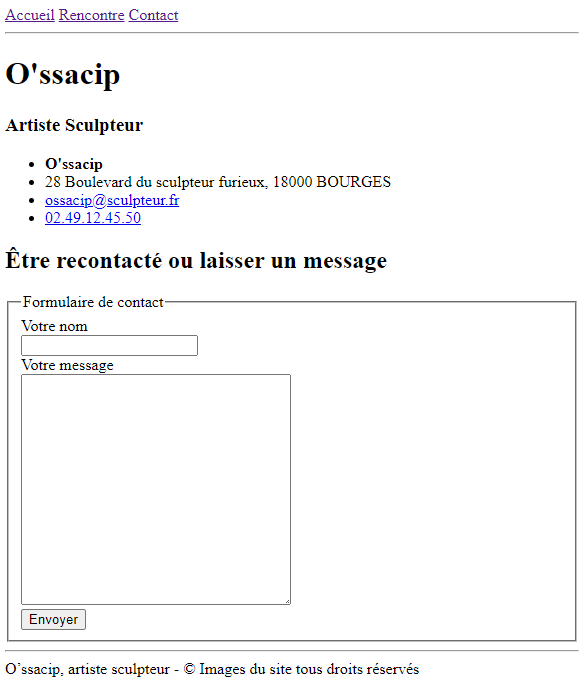

# O'ssacip - Création du site web

- Projet au profit de l'artiste sculpteur O'ssacip, désigné "le client"
- Cahier des charges rédigé par Pauline Oclock représentant l'équipe de développement en charge du projet, désignés "le prestataire"
  - pauline@oclock.io

## Contexte

O'ssacip est un artiste sculpteur français. Il est réputé pour ses sculptures colorées et innovantes. 

Ses travaux sont présentés lors d'expositions et en galerie. Certaines photographies sont publiées sur ses réseaux sociaux (Pinterest, Instagram et Facebook). Son atelier est ouvert aux visiteurs deux jours par semaine. 

Plusieurs clients ont remonté le fait qu'ils avaient rencontré des difficultés à trouver l'atelier et aussi qu'ils aimeraient se tenir au courant des nouvelles œuvres créées par l'artiste sans avoir besoin de passer par les réseaux sociaux.

## Besoin

O'ssacip souhaite disposer de son propre site web afin de présenter l'intégralité de ses œuvres mais aussi de simplifier la prise de contact avec les prospects et clients. 
Le site serait composé de trois pages:
- Une page "Accueil" qui présenterait l'artiste et ses œuvres, 
- Une page "Rencontre" qui permettrait de lister les lieux et dates d'exposition ainsi que la localisation de l'atelier avec ses horaires d'ouverture au public. 
- Une page "Contact" qui serait composée des coordonnées de l'artiste (adresse de l'atelier, numéro de téléphone) et d'un formulaire de contact. 

Les contenus textuels nécessaires à la réalisation du projet sont transmis en annexe.

### Haut de page commun (en-tête)

Un menu sera disponible en haut de chacune des pages et permettra de se déplacer entre celles-ci.
Un lien Accueil renverra vers la page d'accueil,
Un lien Rencontre renverra vers la page Rencontre,
Un lien Contact renverra vers la page Contact.

Sous le menu se trouvera le nom du site "O'ssacip" ainsi que le sous-titre "Artiste Sculpteur".

### Bas de page commun (pied de page)

En bas de chaque page se trouvera la mention "O’ssacip, artiste sculpteur - © Images du site tous droits réservés"

### Accueil

La page Accueil contiendra deux sections:

- Présentation de l'artiste (sans titre) : Une image d'une des créations les plus célèbres de l'artiste (La sculpture "Stopper temps" => les images sont jointes au présent cahier des charges dans le dossier *img/images_site*), suivie du paragraphe de présentation.

La page d'accueil contiendra les photographies des créations de l'artiste dans une section "Créations". 

### Rencontre

La page Rencontre contiendra deux sections:

- "Expositions": Listera les expositions avec leur date, le nom du lieu ainsi que l'adresse pour s'y rendre.
- "L'atelier": Comportera l'adresse de l'atelier, ses horaires d'ouverture au public, ainsi que la possibilité de contacter l'artiste pour convenir d'un rendez-vous avec un lien vers la page Contact.

### Contact

La page Contact contiendra deux sections:

- "Contact": Liste des informations de contact de l'atelier,
- "Être recontacté ou laisser un mot": un formulaire avec deux champs (nom et message) et un bouton "Envoyer".

## Livrables

La première version du projet sera développée uniquement en HTML et ne sera pas déployée. Sa livraison se fera sur un repo Github.

## Contraintes

Le budget du client étant plafonné et le projet urgent, la durée de développement de la partie HTML ne devra pas dépasser une journée.

Le code devra être proprement indenté et commenté pour simplifier les travaux ultérieurs sur le site.

L'intitulé de l'onglet doit changer selon la page sur laquelle on se trouve, on préfixera le nom de la page par "O'ssacip - " (Par exemple "O'ssacip - Accueil").

Toutes les images du site devront être accessibles pour les personnes malvoyantes, donc contenir une description sous forme de texte alternatif. Les descriptions sont fournies dans les contenus textuels.

# Annexes

## Wireframes

### Accueil

### Rencontre

### Contact

## Maquettes

### Accueil

### Rencontre

### Contact

## Contenus

### Toutes les pages:

| Champ texte| Contenu textuel |
| ------------- | ------------- |
| Titre | O'ssacip |
| Sous-titre | Artiste sculpteur |

### Accueil

| Champ texte| Contenu textuel |
| ------------- | ------------- |
| Paragraphe de présentation | O'ssacip, de son nom complet Oscar Sacip, est un artiste sculpteur de pierre et peintre. Passionné depuis son plus jeune âge pour la peinture, l'artiste a découvert la taille de pierre par hasard au cours de son adolescence. Ces deux arts associés sont la marque de fabrique de notre artiste. Grâce à un style bien particulier qui allie expressionnisme et fauvisme dans une technique impeccable, O'ssacip est aujourd'hui reconnu comme un véritable précurseur pour sa création de véritables tableaux peints à même la pierre. Au delà de l'aspect coloré de ses créations, chaque oeuvre est composée de détails (odeurs, textures, matières) difficiles ou impossibles à distinguer avec les yeux. Son ouvrage, centré sur les émotions visuelles, olfactives et tactiles, est qualifié d'authentique et de provoquant par la critique. Très accessible, l'artiste aime partager des moments avec son public et ouvre son atelier aux visites certains jours de la semaine. |

Images des oeuvres:

| Titre de l'œuvre | Image associée | Texte alternatif |
| :-------------: | ------------- | ----- |
| Déjeuner Français | dejeuner_francais.png | Sculpture colorée d'un homme à béret, positionnée dans un parc, assis sur une pierre, tenant un plateau de pain entre ses mains. |
| Fillette et son ourson | fillette_ourson.png | Sculpture colorée d'une fillette positionnée adossée à un mur. La fillette serre son ours en peluche contre elle et semble triste. |
| Liberté | liberte.png | Sculpture colorée d'une femme s'extirpant d'un trou dans un mur de briques. |
| Jeunesse | jeunesse.png | Sculpture colorée d'une femme s'accrochant à une horloge. Sa posture laisse volontairement dubitatif, on ne sait si elle tente de s'accrocher à l'horloge pour ne pas tomber ou si elle danse. La sculpture est positionnée sur la face extérieure d'une maison. |
| Féline | feline.png | Sculpture d'une femme à tête de félin colorée arborant des tresses et un collier de cuir. Elle tourne la tête et semble pensive. |
| Souris heureuses | souris_heureuses.png | Sculpture colorée de deux souris souriantes tenant une échelle devant un gros bout de fromage qui semble coincé. |
| Chat venu d'ailleurs | chat_alien.png | Sculpture colorée d'un chat rieur assis à l'intérieur d'une capsule spatiale. |
| Chien joyeux | chien_joyeux.png | Sculpture colorée d'un chien rieur portant un collier de perles et tirant la langue. |
| Stopper le temps | stopper_temps.png | Sculpture d'une femme en robe accrochée à une des aiguilles d'une horloge. Sa peau semble vieillie par endroits. Elle est dans un mouvement d'élan vers l'avant mais son bras accroché à l'aiguille semble fermement tenter de tirer celle-ci vers l'arrière. |
| Bac à sable | bac_a_sable.png | Sculpture colorée d'un enfant en salopette courte et pieds nus qui semble manger quelque chose qu'il tient dans une de ses mains. Ses yeux sont de taille différente, ce qui lui donne un air innocent. |
| Télétravailleur dans sa bulle | teletravailleur.png | Sculpture colorée d'un homme en chemise et pantalon, assis, en train de travailler sur un ordinateur portable. Sa tête est une sphère sans visage. |
| Vie | vie.png | Sculpture d'une grenouille, un genou à terre, levant fièrement à bout de bras une sphère lumineuse qui ressemble à un oeuf rond. |

### Rencontre

Expositions:

| Date | Lieu | Adresse |
| ------------- | ------------- | ----- |
| 9 juillet 2022 | Galerie Maeght | 42 Rue du Bac, 75007 PARIS |
| 17 septembre 2022 | Carré d'artistes | 37 Rue de Brest, 69002 LYON |
| 22 décembre 2022 | Galerie 170 | 170 Grand'Rue, 86000 POITIERS |
| 11 février 2023 | NextStreet Gallery | 23 Pl. des Vosges, 75004 PARIS |

Venir à l'atelier:

| Champ texte| Contenu textuel |
| ------------- | ------------- |
| Adresse de l'atelier | O'ssacip, 28 Boulevard du sculpteur furieux, 18000 BOURGES |
| Jours d'ouverture | Atelier ouvert (hors dates d'exposition) les lundi, mercredi et vendredi de 16h à 21h. Pour visiter l'atelier en dehors des horaires d'ouverture, n'hésitez pas à téléphoner. |

### Contact

| Champ texte| Contenu textuel |
| ------------- | ------------- |
| Nom de l'entreprise | O'ssacip |
| Adresse de l'atelier | 28 Boulevard du sculpteur furieux, 18000 BOURGES |
| Mail de l'entreprise | ossacip@sculpteur.fr |
| Téléphone de l'entreprise | 02.49.12.45.50 |

Voici les user stories sous forme de tableau :

| User Story | En tant que... | Je veux... | Afin de... |
|------------|--------------|-----------|------------|
| 1          | Artiste O'ssacip | une page "Accueil" sur mon site web | présenter mon travail et ma sculpture "Stopper temps" pour donner aux visiteurs un aperçu de mon style artistique. |
| 2          | Artiste O'ssacip | une section sur la page "Accueil" qui affiche des photographies de mes créations colorées et innovantes | montrer la diversité de mon portfolio. |
| 3          | Visiteur du site | un menu en haut de chaque page | pour pouvoir naviguer facilement entre les pages "Accueil," "Rencontre," et "Contact" pour trouver rapidement les informations que je recherche. |
| 4          | Visiteur du site | une page "Rencontre" qui liste les lieux et dates de mes expositions, ainsi que l'adresse de mon atelier et ses horaires d'ouverture | pour pouvoir planifier ma visite. |
| 5          | Visiteur du site | un formulaire de contact sur la page "Contact" avec des champs pour mon nom et mon message, ainsi qu'un bouton "Envoyer" | pour pouvoir entrer en contact avec l'artiste. |
| 6          | Visiteur du site | des informations de contact claires sur la page "Contact" avec l'adresse de l'atelier d'O'ssacip et son numéro de téléphone | pour pouvoir le contacter directement si nécessaire. |
| 7          | Visiteur du site | que toutes les images du site, y compris les photographies des créations, contiennent des descriptions textuelles alternatives | pour rendre le site accessible à tous, y compris les personnes malvoyantes. |
| 8          | Visiteur du site | que le titre de l'onglet de mon navigateur change en fonction de la page sur laquelle je me trouve, en ajoutant "O'ssacip - " devant le nom de la page | pour une navigation plus claire. |

Ce tableau présente chaque user story, l'utilisateur concerné, la demande spécifique, et l'objectif de la demande. Vous pouvez utiliser ce tableau pour suivre et gérer le développement de votre site web en vous assurant que toutes les fonctionnalités nécessaires sont prises en compte.
